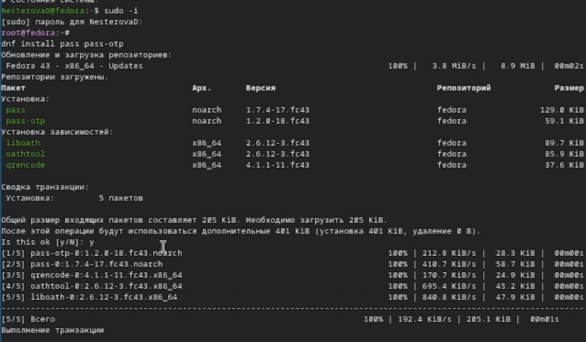
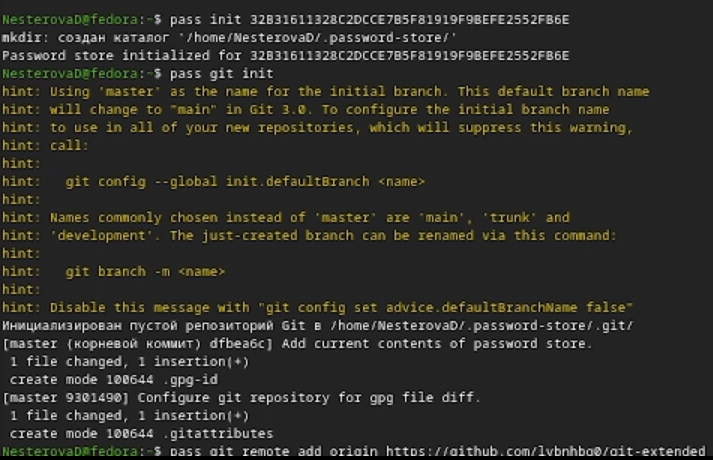
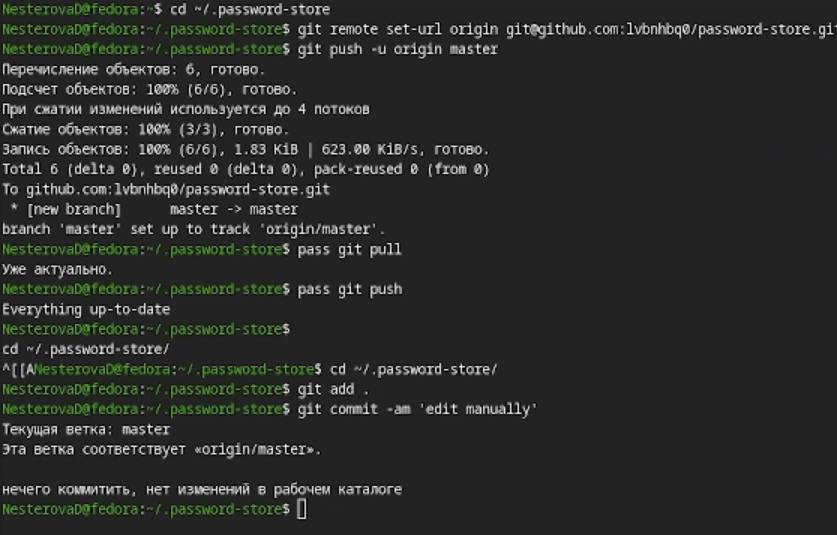
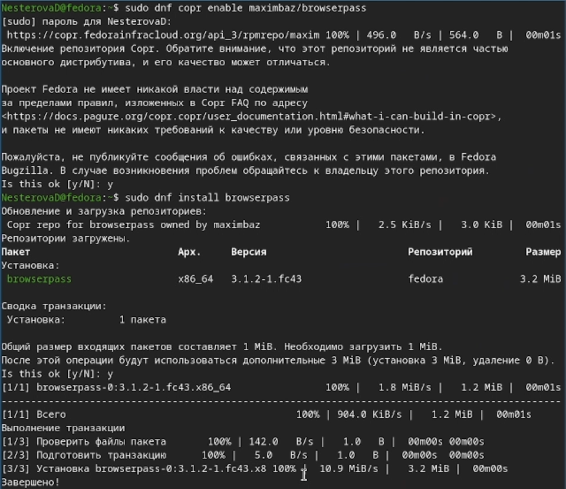
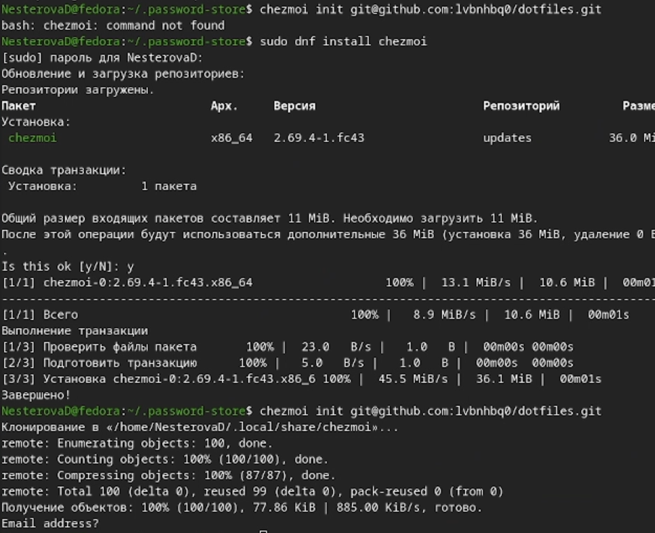
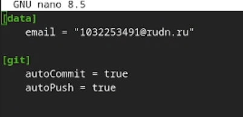

# Информация

## Докладчик

:::::::::::::: {.columns align=center}
::: {.column width="70%"}

  * Кочан Лина Романовна
  * Студент НКАбд-04-25
  * Российский университет дружбы народов
  * [1032252474@rudn.ru](mailto:1032252474@rudn.ru)

:::

::::::::::::::

# Цель работы

Познакомиться с pass, gopass, native messaging, chezmoi. Научиться пользоваться этими утилитами, синхронизировать их с гит.

# Задание

1. Установить дополнительное ПО
2. Установить и настроить pass
3. Настроить интерфейс с браузером
4. Сохранить пароль
5. Установить и настроить chezmoi
6. Настроить chezmoi на новой машине
7. Выполнить ежедневные операции с chezmoi

# Теоретическое введение

Менеджер паролей pass — программа, сделанная в рамках идеологии Unix. Также носит название стандартного менеджера паролей для Unix (The standard Unix password manager).
1.1 Основные свойства
    Данные хранятся в файловой системе в виде каталогов и файлов.
    Файлы шифруются с помощью GPG-ключа.
1.2 Структура базы паролей
    Структура базы может быть произвольной, если Вы собираетесь использовать её напрямую, без промежуточного программного обеспечения. Тогда семантику структуры базы данных Вы держите в своей голове.
    Если же необходимо использовать дополнительное программное обеспечение, необходимо семантику заложить в структуру базы паролей.
chezmoi используется для управления файлами конфигурации домашнего каталога пользователя. 

# Выполнение лабораторной работы

Устанавливаю pass. (рис. 1)

{#fig:001 width=70%}

---

Инициализирую pass на машине, создаю первый пароль. (рис. 2)

{#fig:001 width=70%}

---

Устанавливаю дополнительное ПО и шрифты. (рис. 3)

{#fig:001 width=70%}

---

Содаю и настраиваю репозиторий. (рис. 4)

{#fig:001 width=70%}

---

Скачиваю пакеты, настраиваю интерфейс с броузером. (рис. 5)

{#fig:001 width=70%}

---

Скачиваю chezmoi, настраиваю машину и изучаю ежедневные команды. (рис. 6)

{#fig:001 width=70%}

---

Изменяю конфигурацию, включив автоматическое фиксирование изменений. (рис. 7)

{#fig:001 width=70%}

---

# Выводы

Я  познакомилась с pass, gopass, native messaging, chezmoi. Научилась пользоваться этими утилитами, а также синхронизировала их с гит.
