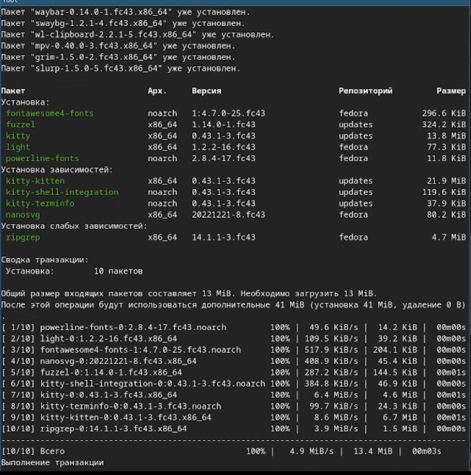

---
## Front matter
title: "Лабораторная работа №5"
author: "Кочан Лина Романовна"

## Generic options
lang: ru-Ru\
toc-title: "Содержание"

## Bibliography
bibliography: bib/cite.bib
csl: pandoc/csl/gost-r-7-0-5-2008-numeric.csl

##Pdf output format
toc: true 
toc-depth: 2
lof: true
lot: true
fontsize: 12pt
linestretch: 1.5
papersize: a4
documentclass: scrreprt

polyglossia-lang:
   name: russian
   options:
   - spelling=modern
   - babelshorhands=true
polyglossia-otherlangs:
   name: english

babel-lang: russian
babel-otherlangs: english
mainfont: Times New Roman
sansfont: Arial
monofont: Courier New
mathfont: Times New Roman

biblatex: true
biblio-style: "gost-numeric"
biblatexoptions:
    - parentracker=true
    - backend=biber
    - hyperref=auto
    - language=auto
    - autolang=other*
    - citestyle=gost-numeric

igureTitle: "Рис."
tableTitle: "Таблица"
listingTitle: "Листинг"
lofTitle: "Список иллюстраций"
lotTitle: "Список таблиц"
lolTitle: "Листинги"

indent: true
header-includes:
  - \usepackage{indentfirst}
  - \usepackage{float} 
  - \floatplacement{figure}{H} 
---

# Цель работы

Познакомиться с pass, gopass, native messaging, chezmoi. Научиться пользоваться этими утилитами, синхронизировать их с гит.

# Задание

1. Установить дополнительное ПО
2. Установить и настроить pass
3. Настроить интерфейс с браузером
4. Сохранить пароль
5. Установить и настроить chezmoi
6. Настроить chezmoi на новой машине
7. Выполнить ежедневные операции с chezmoi

# Теоретическое введение

Менеджер паролей pass — программа, сделанная в рамках идеологии Unix. Также носит название стандартного менеджера паролей для Unix (The standard Unix password manager).
1.1 Основные свойства
    Данные хранятся в файловой системе в виде каталогов и файлов.
    Файлы шифруются с помощью GPG-ключа.
1.2 Структура базы паролей
    Структура базы может быть произвольной, если Вы собираетесь использовать её напрямую, без промежуточного программного обеспечения. Тогда семантику структуры базы данных Вы держите в своей голове.
    Если же необходимо использовать дополнительное программное обеспечение, необходимо семантику заложить в структуру базы паролей.
chezmoi используется для управления файлами конфигурации домашнего каталога пользователя. 
Конфигурация chezmoi
    2.2.1 Рабочие файлы
    Состояние файлов конфигурации сохраняется в каталоге ~/.local/share/chezmoi. Он является клоном вашего репозитория dotfiles.
    Файл конфигурации ~/.config/chezmoi/chezmoi.toml (можно использовать также JSON или YAML) специфичен для локальной машины.
    Файлы, содержимое которых одинаково на всех ваших машинах, дословно копируются из исходного каталога.
    Файлы, которые варьируются от машины к машине, выполняются как шаблоны, обычно с использованием данных из файла конфигурации локальной машины для настройки конечного содержимого, специфичного для локальной машины.

# 4. Выполнение лабораторной работы

Устанавливаю pass. (рис. 1)

{#fig:001 width=70%}

Инициализирую pass на машине, создаю первый пароль. (рис. 2)

{#fig:001 width=70%}

Устанавливаю дополнительное ПО и шрифты. (рис. 3)

{#fig:001 width=70%}

Содаю и настраиваю репозиторий. (рис. 4)

{#fig:001 width=70%}

Скачиваю пакеты, настраиваю интерфейс с броузером. (рис. 5)

{#fig:001 width=70%}

Скачиваю chezmoi, настраиваю машину и изучаю ежедневные команды. (рис. 6)

{#fig:001 width=70%}

Изменяю конфигурацию, включив автоматическое фиксирование изменений. (рис. 7)

{#fig:001 width=70%}

# 5. Выводы

Мы познакомились с pass, gopass, native messaging, chezmoi. Научились пользоваться этими утилитами, синхронизировали их с гит.

